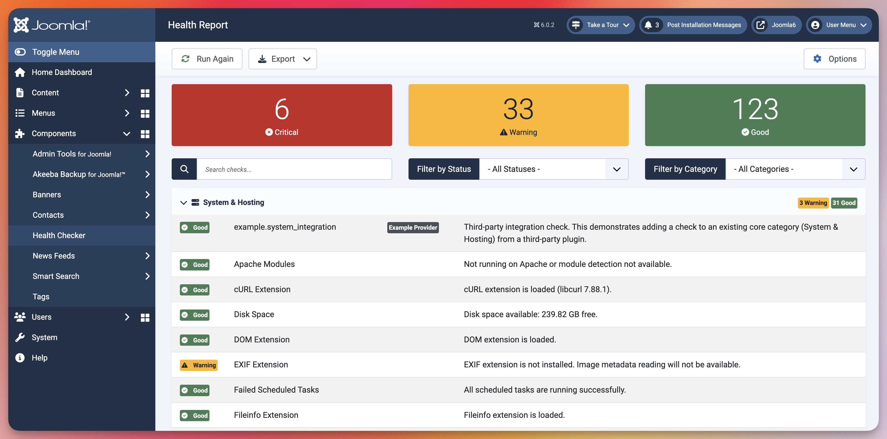

#  Health Checker for Joomla

A comprehensive health monitoring extension for Joomla 5+ with over 129 checks across 8+ categories and an extensible plugin architecture.

**Website**: [https://www.joomlahealthchecker.com](https://www.joomlahealthchecker.com)

**Documentation**: [https://www.joomlahealthchecker.com/docs/getting-started](https://www.joomlahealthchecker.com/docs/getting-started)

**Repository**: [https://github.com/mySites-guru/HealthCheckerForJoomla](https://github.com/mySites-guru/HealthCheckerForJoomla)

**License**: GPL v2+ (same as Joomla)

**Requirements**: Joomla 5.0+, PHP 8.1+



## Features

- **Over 129 Health Checks** across 8+ categories (System, Database, Security, Users, Extensions, Performance, SEO, Content)
- **Event-Driven Architecture** - Third-party plugins can add custom checks and categories
- **Dashboard Widget** - Quick site status overview
- **AJAX API** - 5 endpoints for integration
- **Export Reports** - JSON and HTML formats
- **Super Admin Only** - Strict access control
- **No Database Tables** - Session-based results (no history tracking)

## Documentation

- **[User Guide](https://www.joomlahealthchecker.com/docs/)** - Installation, usage, and check reference
- **[Developer Guide](https://www.joomlahealthchecker.com/docs/developers/)** - Create third-party plugins to add custom checks
- **[Core Development Docs](docs/DEV/)** - Architecture, implementation, build process (for core contributors)
- **[Community Plugins](COMMUNITY_PLUGINS.md)** - Third-party plugins built by the community
- **[CONTRIBUTING.md](CONTRIBUTING.md)** - How to contribute to the project
- **[CI/CD Setup](.github/workflows/README.md)** - Automated testing and quality checks

## Quick Links

- [Installation Guide](https://www.joomlahealthchecker.com/docs/installation)
- [Getting Started](https://www.joomlahealthchecker.com/docs/getting-started)
- [All Checks Explained](https://www.joomlahealthchecker.com/docs/checks/)
- [Create Custom Checks](https://www.joomlahealthchecker.com/docs/developers/)

## Development Setup

See [CONTRIBUTING.md](CONTRIBUTING.md) for complete development setup instructions.

### Quick Start (Docker with Orbstack)

```bash
# Clone repository
git clone https://github.com/mySites-guru/HealthCheckerForJoomla.git
cd health-checker-for-joomla

# Download Joomla 5/6 and place in the 'joomla' directory

# Install dependencies
composer install

# Start Docker environment
docker compose up -d

# Access Joomla installer
open http://localhost:8080/installation/index.php
```

**Database Configuration** (for Joomla installer):
- Host: `healthchecker-mysql`
- Database: `joomla`
- Username: `root`
- Password: `webdevroot`

### Code Quality

```bash
composer check        # Run all quality checks
composer cs:fix       # Auto-fix code style
composer test         # Run PHPUnit tests
composer phpstan      # Static analysis (Level 8)
```

**CI/CD**: GitHub Actions runs all checks on every push/PR across PHP 8.1-8.5.

## Project Status

**Status**: Active Development

| Component | Status |
|-----------|--------|
| Core Infrastructure | ✅ Complete |
| Core Checks (129 files) | ✅ Complete |
| Dashboard Module | ✅ Complete |
| Example Plugin (SDK) | ✅ Complete |
| MySites.guru Integration | ✅ Complete |
| Akeeba Integrations | ✅ Complete |
| Build System | ✅ Complete |
| Test Coverage | [](https://github.com/mySites-guru/HealthCheckerForJoomla/actions/workflows/ci.yml) |
| Documentation | ✅ Complete |

## Architecture

```
Health Checker Architecture
├── Component (com_healthchecker)           - Admin UI, event dispatcher, services
├── Core Plugin (plg_healthchecker_core)    - 129 built-in checks
├── Module (mod_healthchecker)              - Dashboard widget
└── Optional Integrations
    ├── Akeeba Backup plugin                - Backup monitoring
    ├── Akeeba Admin Tools plugin           - Security monitoring
    └── MySites.guru plugin                 - API integration for site management
```

### Extensible Event System

Plugins can add:
- **Custom health checks** (via `CollectChecksEvent`)
- **Custom categories** (via `CollectCategoriesEvent`)
- **Provider metadata** (via `CollectProvidersEvent`)

No code changes needed - automatic discovery via Symfony Event Dispatcher.

## Support & Funding

The best way to support this project is by subscribing to **[mySites.guru](https://mysites.guru)** for unlimited Joomla site management:

- Automated health monitoring 
- One-click updates for Joomla core and extensions
- Automated backups with offsite storage with Akeeba Backup
- Security auditing and malware/suspect content detection
- Performance monitoring and optimization
- 24/7 uptime monitoring
- Expert support from Phil himself.

Your subscription directly funds the development and maintenance of Health Checker for Joomla and other open-source tools for the community.

**Learn more**: [https://mysites.guru](https://mysites.guru)

## Contributing

Contributions are welcome! Please see [CONTRIBUTING.md](CONTRIBUTING.md) for:

- Development setup
- Code quality standards (PHPStan Level 8, PSR-12, Rector)
- Git workflow and PR process
- How to add new health checks
- Creating third-party plugins

## Credits

**Developed by**: [Phil E. Taylor](https://www.phil-taylor.com) for [mySites.guru](https://mysites.guru)
**Contributors**: See [GitHub Contributors](https://github.com/mySites-guru/HealthCheckerForJoomla/graphs/contributors)

## License

GPL v2 or later - Same as Joomla. See [LICENSE.txt](LICENSE.txt) for details.

Copyright (C) 2026 mySites.guru + Phil E. Taylor
